# Data Lovers

## Descripción general del proyecto

Pokemon es una app que te permite conocer más sobre pokemones y hacer una comparación entre estos mismo para que puedas elegir entre tus pokemones y te  prepares con el mejor para la batalla.

## Definición del usuario

Todos aquellas personas que juegan pokemon y necesitan saber información off-line en caso de alguna pelea, para prepararse para la batalla y saber si pueden ganar o no.

## Historia de Usuario

* Yo como usuario quiero ver las debilidades de otros pokemos para poder atacarlos.
* Yo como usuario quiero saber las ventajas contra los adversarios.
* Yo como usuario quiero saber a que tipo de pokemon pertenece.
* Yo como usuario quiero conocer los ataques.
* Yo como usuario quiero saber si son de primera o segunda generación.

A los usuarios no les interesa conocer el peso, ni la altura de los pokemon.

### Necesidad

Saber cuales son los pokemones débiles y fuertes en combate, para poder ganar las batallas pokemon.

### Objetivo

Dar a conocer información esencial de cada pokemon para que el usuario pueda comparar caracteristicas especiales de sus pokemon y pueda elegir al mejor para la batalla.

## Prototipado de baja fidelidad

Como metologia de trabajo para el prototipado de baja fidelidad de utilizo Scketch, los cuales son de rápida creación, faciles de cambiar, de bajo coste económico, y para los usuarios es mas facil y comodo proponer cambios y opinar.

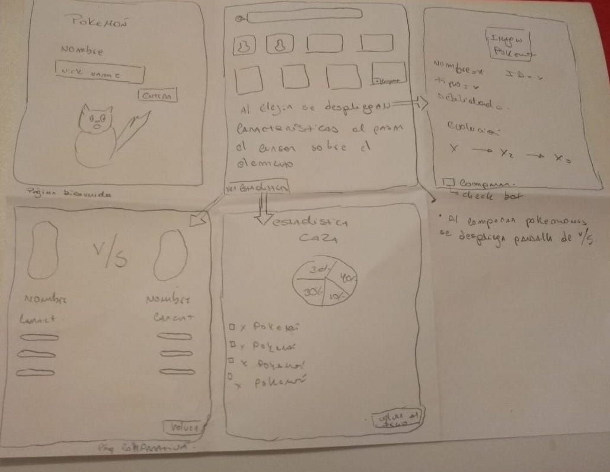

### Test de usabilidad

Se testeo a un posible usuario presentándole el siguiente caso.

Contexto: Imagina que estás jugando pokemon y necesitas prepararte para una batalla, quieres ganar y necesitas saber cuál de tus pokemones es mejor.

Además se le propino una serie de pantallas para que fuera interactuando con ellas.

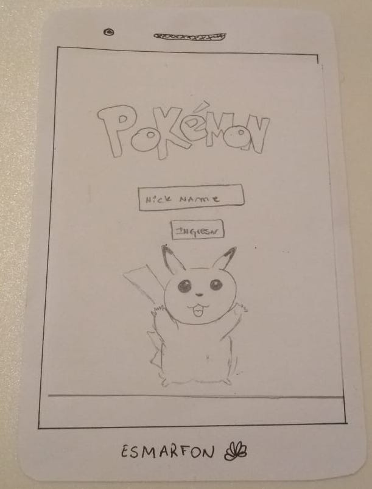
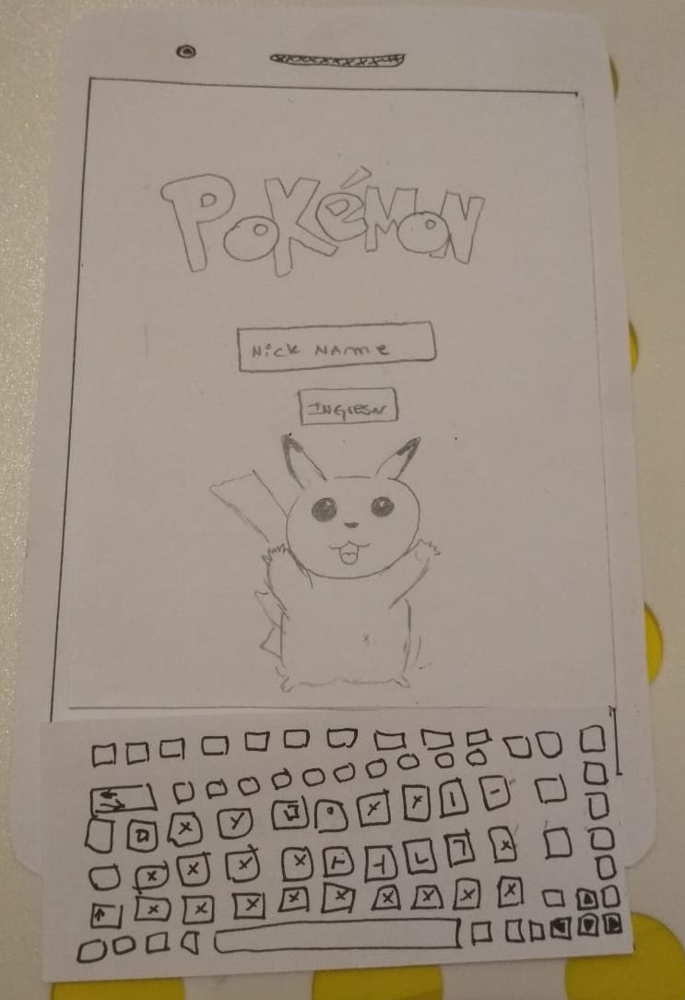
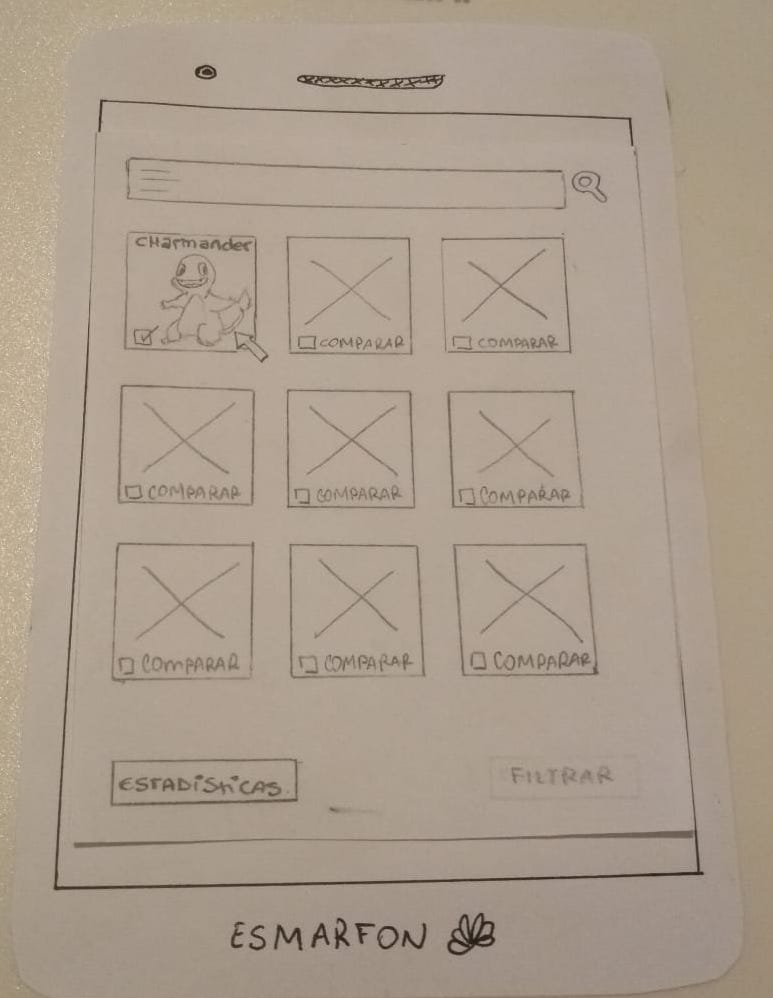
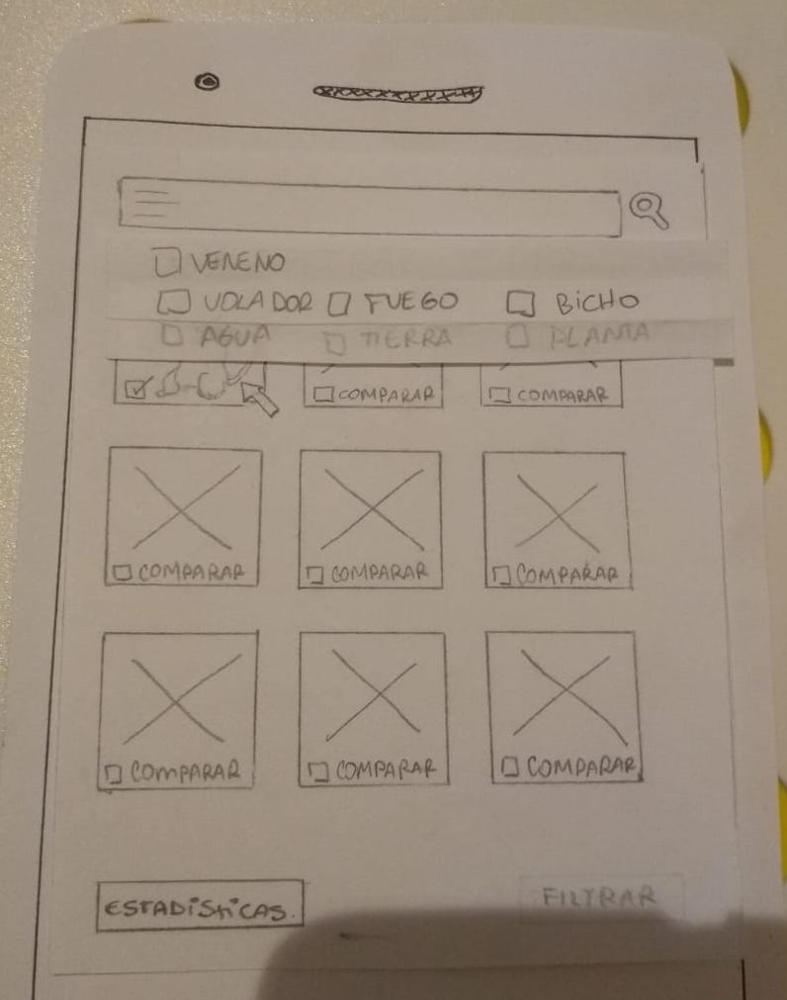
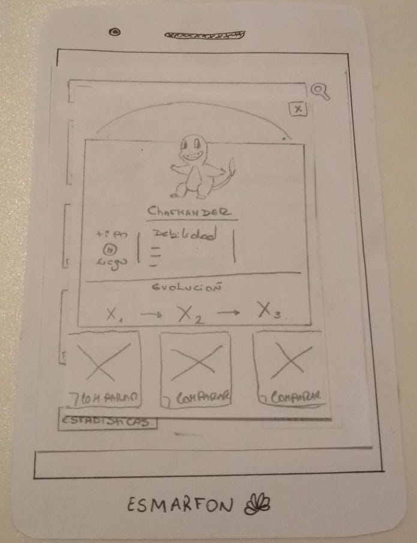

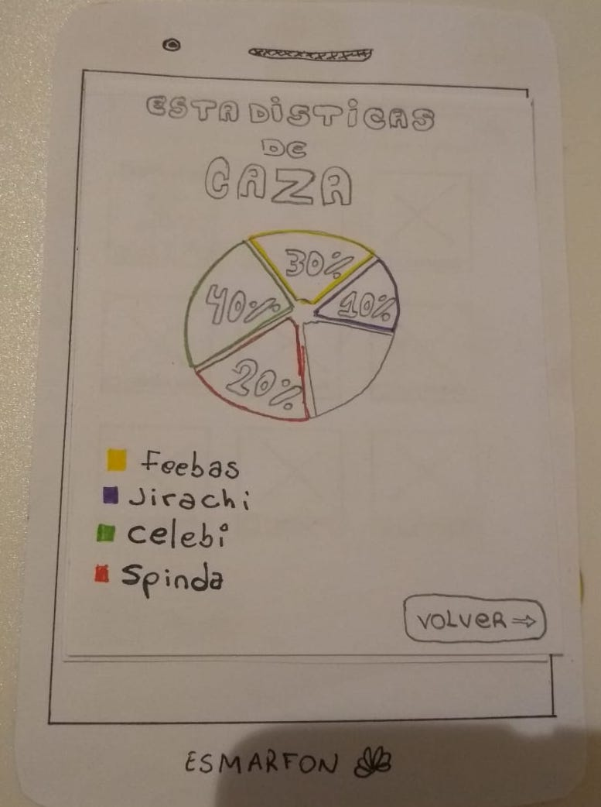

Pregunta: ¿Qué te gustaría que te mostrara esta aplicación para pokemon?

Respuesta: 

* Usuario uno: Daniel (31 años) dice que entiende la aplicación pero falta información en la página de comparación.

* Usuario dos: Natalia (28 años) dice que entendió la aplicación, pero la confunde el botón de estadisticas y lo que muestra.

* Usuario tres: Pedro (20 años) dice que le gustaria que la aplicacion fuera más descriptiva en cada página que muestra.

* Usuario cuatro: Sebástián (30 años) dice que le gustaría que la parte de filtrar fuera más clara

## Prototipado de alta fidelidad

Se realizo un prototipado de alta fidelidad con FIGMA, que nos ayuda a desarollar interfaces de usuario dentro del navegador, sin tener que acudir a software nativo.
Esto acarrea una serie de ventajas para el flujo de trabajo y también para la portabilidad de los diseños y el acceso a los mismos. 

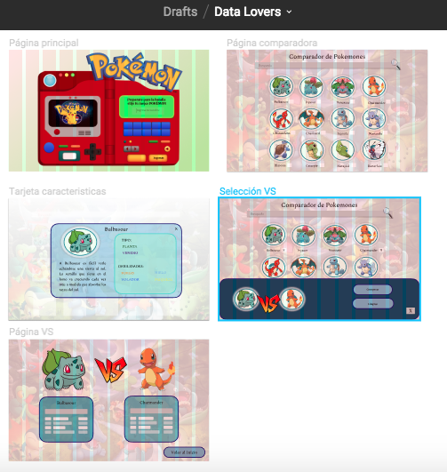

Al usuario se le mostro figma en base al siguiente contexto:
"Imagina que estás jugando pokemon y necesitas prepararte para una batalla, quieres ganar y necesitas saber cuál de tus pokemones es mejor".

Pregunta: ¿Qué te gustaría que te mostrara esta aplicación para pokemon?

* Usuario uno: Bástian (30 años) dice -> "Me encantó la aplicación pero siento que en la tarjeta de caracteristica le falta más color".

* Usuario dos: Jorge (33 años) dice -> "Me gusta el diseño pero en la parte de busqueda uno no puede filtrar pokemones y me gustaria poder hacerlo".

* Usuario tres: Rodrigo (25 años) dice -> "Me parece facil de usar, pero falta más explicación en cada pantalla".

* Usuario cuatro: Tomas (18 años) dice -> "Me gustó la aplicación, no creo que le falte nada"

* Usuario cinco: Martina (21 años) dice -> "Muy buena aplicación, pero no entiendo la página para comparar"

### Conclusiones

Gracias a los testeos de usabilidad con las distintas herramientas, nos pudimos dar cuenta que faltaba un menu de filtrar más claro, que faltaba color en ciertas partes de nuestra aplicación y además de que cada pantalla fuera más explicativa en como funciona.
Todo esto se tomo en cuenta para tomar desiciones de diseño y cambios en la interfaz.

## Desarrollo Interfaz

A traves de los distintas historias de usuario, brainstorming, test de usabilidad, se pudo desarrollar una interfaz más amigable con el usuario. Gracias a todo esto se logró tomar decisiones sobre colores, imagenes, disposicion de los contenedores, fuentes etc.

En cuanto a los colores nos podemos dar cuenta que cada boton en el cuadro de filtrar corresponde a los colores utilizados para cada tipo de pokémon dispuestos en la página oficial de pokémon y así cada tarjeta tambien nos recuerda los colores utilizados por la aplicació PokémonGo, los que son ya conocidos por los usuarios e identificatorios para la app.

Las imagenes también conrresponden a la serie Pókemon lo que hace más familiar a la vista del usuario que juega Pokémon o es visor de la serie.

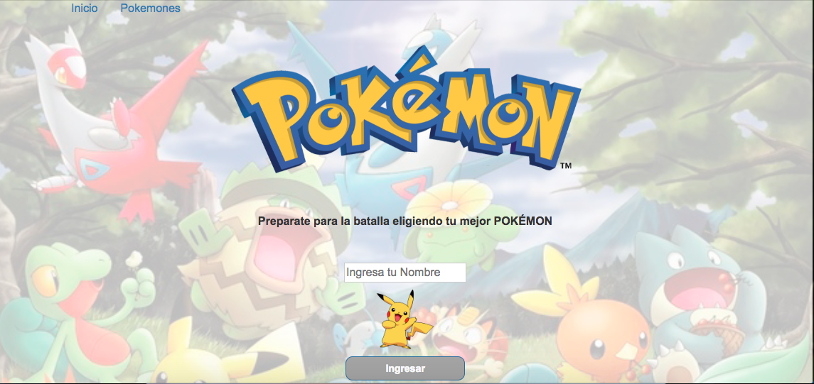

## Planificación

Se utilizó un TODO para lograr la plánificación del proyecto, la cúal se fue modificando a medida que transcurria el tiempo.

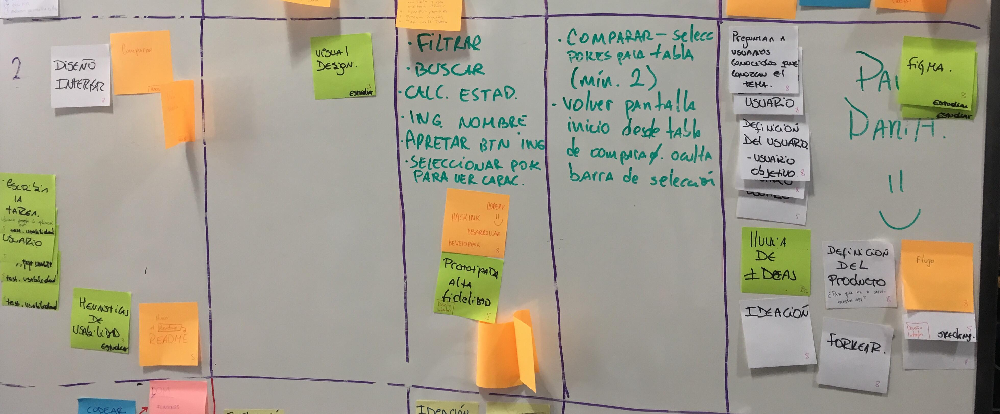
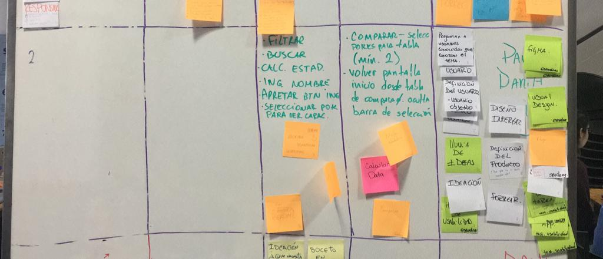

